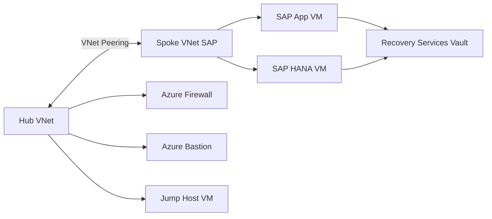

# Terraform Design Plan – Reusable SAP Hub-and-Spoke Azure Codebase

## Purpose
This document defines the **Terraform design plan** for implementing a **reusable, standards‑compliant Terraform codebase** to deploy the SAP S/4HANA hub‑and‑spoke architecture described in [`plans/requirements-defined.md`](plans/requirements-defined.md).  
The plan strictly adheres to:
- [`plans/terraform-standards.md`](plans/terraform-standards.md) – Unified Master Terraform Coding Standards
- [`plans/Session-prompt.md`](plans/Session-prompt.md) – Mandatory module‑first and environment lifecycle rules

This is **Step 1 – PLAN ONLY**. No Terraform code is generated in this phase.

---

## 1. High-Level Architecture Overview

**Topology:** Hub-and-Spoke (single Azure region)  
**Workload:** SAP S/4HANA (Jump Host, SAP App, SAP HANA DB)  
**Design Principles:**
- Strict network isolation
- Module-first Terraform architecture
- Object-based inputs
- Locals-first environment configuration
- Zero hardcoding of environment values in modules

### Logical Architecture



---

## 2. Repository Structure (Target State)

Conforms exactly to the structure mandated in [`plans/terraform-standards.md`](plans/terraform-standards.md):

```text
Infrastructure/
├── modules/
│   ├── swo_azurerm_vnet/
│   ├── swo_azurerm_subnet/
│   ├── swo_azurerm_nsg/
│   ├── swo_azurerm_route_table/
│   ├── swo_azurerm_vnet_peering/
│   ├── swo_azurerm_storage_account/
│   ├── swo_azurerm_managed_disk/
│   ├── swo_azurerm_linux_vm/
│   ├── swo_azurerm_proximity_placement_group/
│   ├── swo_azurerm_recovery_services_vault/
│   ├── swo_azurerm_vm_backup/
│   └── swo_azurerm_sap_hana_backup/
│
├── environments/
│   └── prod-weu-sap/
│       ├── main.tf
│       ├── versions.tf
│       ├── variables.tf
│       ├── locals.tf
│       ├── network.tf
│       ├── storage.tf
│       ├── compute.tf
│       ├── backup.tf
│       └── outputs.tf
│
└── plans/
    └── terraform-sap-hubspoke-design-plan.md
```

---

## 3. Required Reusable Modules

Modules are listed in **mandatory creation order** per [`plans/Session-prompt.md`](plans/Session-prompt.md).

### 3.1 Network Modules

| Module | Responsibility |
|------|---------------|
| `swo_azurerm_vnet` | Create VNets using object-based address space input |
| `swo_azurerm_subnet` | Create subnets, service endpoints, and delegation |
| `swo_azurerm_nsg` | Create NSGs and security rules from rule objects |
| `swo_azurerm_route_table` | Create UDRs with firewall routing |
| `swo_azurerm_vnet_peering` | Hub-to-Spoke and Spoke-to-Hub peering |

All network modules:
- Accept a **single object variable**
- Output `id` and `name`
- Do not embed CIDRs or names

---

### 3.2 Storage Modules

| Module | Responsibility |
|------|---------------|
| `swo_azurerm_storage_account` | Diagnostics + SAP backup storage |
| `swo_azurerm_managed_disk` | Premium SSD v2, Premium SSD, Standard SSD disks |

Disk module design must support:
- Performance parameters (IOPS / throughput)
- Multiple disks per VM via `for_each`

---

### 3.3 Compute Modules

| Module | Responsibility |
|------|---------------|
| `swo_azurerm_linux_vm` | SAP App + HANA Linux VMs |
| `swo_azurerm_proximity_placement_group` | Low-latency App/DB placement |

Linux VM module must support:
- Accelerated networking
- Multiple NICs (future-proofed)
- Managed identity
- OS + data disks attachment

---

### 3.4 Backup Modules

| Module | Responsibility |
|------|---------------|
| `swo_azurerm_recovery_services_vault` | Central RSV |
| `swo_azurerm_vm_backup` | VM snapshot policies |
| `swo_azurerm_sap_hana_backup` | Azure Backup for SAP HANA |

Backup modules must expose policy IDs for dependency wiring.

---

## 4. Environment Code Responsibilities (prod-weu-sap)

Environment code **MUST NOT** declare Azure resources directly.

### File Responsibilities

| File | Responsibility |
|----|---------------|
| `main.tf` | Backend and provider configuration only |
| `versions.tf` | Terraform + provider constraints |
| `variables.tf` | Environment inputs (region, tags, naming) |
| `locals.tf` | **ALL configuration data** (CIDRs, sizes, SKUs, rules) |
| `network.tf` | Instantiate network modules only |
| `storage.tf` | Instantiate storage and disk modules |
| `compute.tf` | Instantiate PPG + VM modules |
| `backup.tf` | Instantiate RSV and backup modules |
| `outputs.tf` | Expose key resource IDs |

---

## 5. Mapping Requirements → Terraform Design

### Network
- Hub VNet + Spoke VNet via `swo_azurerm_vnet`
- Subnets via `swo_azurerm_subnet`
- NSGs per subnet via `swo_azurerm_nsg`
- UDR forcing 0.0.0.0/0 → Firewall via `swo_azurerm_route_table`
- Peering via `swo_azurerm_vnet_peering`

### Compute
- Jump Host: Linux or Windows VM (Linux module reused initially)
- SAP App VM: E-series, accelerated networking
- SAP HANA VM: Certified SKU, premium disks, proximity placement

### Storage
- Premium SSD v2 disks for HANA data/log/shared
- Standard SSD for backup volume
- Storage Account for diagnostics

### Backup
- RSV deployed once
- VM backup for Jump + App
- SAP HANA backup with log + full policies

---

## 6. Standards Compliance Checklist

This plan explicitly complies with:
- Object-only module inputs ✅
- Locals-first environment configuration ✅
- No hardcoded environment data in modules ✅
- One primary resource per module ✅
- Mandatory module outputs ✅
- Strict module creation order ✅
- No azurerm_* resources in environment files ✅

---

## 7. Next Steps (Post-Approval)

1. Create missing modules in required order
2. Validate module interfaces against standards
3. Generate environment code file-by-file
4. Perform code review per [`plans/Code-review-prompt.md`](plans/Code-review-prompt.md) - fix any errors found

---

**Status:** Planning phase complete. Ready for validation and approval.